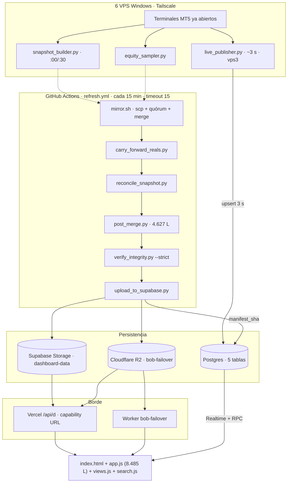
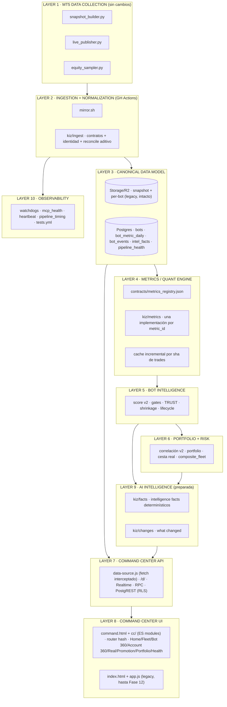
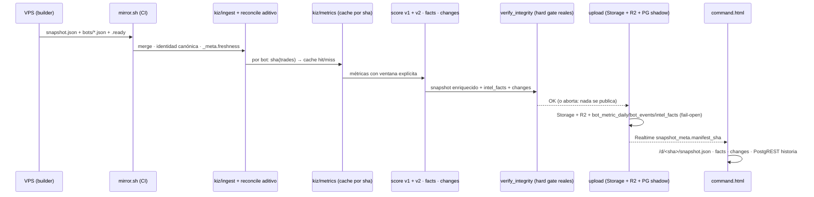
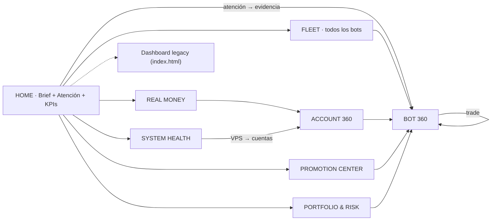

# KIZ COMMAND CENTER — IMPLEMENTATION BLUEPRINT

**Proyecto:** Kiz Capital LLC · Battle of Bots → Kiz Capital Command Center (Trading Intelligence OS)
**Fecha:** 2026-09-08
**Rama inspeccionada:** `resync-vps-numbering` @ `91f6a6f` (main @ `073b4fc`, 2 commits por detrás)
**Base documental:** `KIZ_CAPITAL_PLATFORM_MASTER_AUDIT.md` (2026-09-07), re-verificada contra el código el 2026-09-08
**Estado:** DISEÑO. Ninguna línea de producción modificada. Ningún deploy. Ninguna migración.

**Convenciones:** `[CONFIRMED]` verificado en código en esta pasada · `[AUDIT]` tomado de la auditoría y no re-verificado aquí · `[DIFFERS]` la auditoría y el código difieren; manda el código · `[OWNER]` acción que solo el owner puede ejecutar (VPS, credenciales, historial git, DNS) · `[CLAUDE]` acción en el repo del Mac. **Este documento no contiene logins, IPs públicas, puertos, emails ni claves.**

---

## 1. Executive Vision

Battle of Bots responde hoy muy bien a una pregunta: *¿cuál de mis bots va ganando?* El Command Center debe responder diez, en ≤3 interacciones cada una: qué pasa ahora, hay algún problema, qué bots necesitan atención, cuáles son los mejores, cuáles se deterioran, cuáles son candidatos a real, qué pasa con el dinero real, qué cambió desde ayer, dónde está concentrado el riesgo, y si la infraestructura está sana.

Principios que gobiernan todo el diseño:

1. **El bot es la entidad central.** Todo (métricas, eventos, promoción, correlación, trades) cuelga de una identidad canónica de bot. Hoy no existe (§5).
2. **Una sola verdad por métrica, con ventana explícita en el nombre.** Hoy hay 4 Calmar, 3 Sortino, 5 Sharpe, 2 win-rate y tres bases de P&L sobre el mismo bot (§6).
3. **Frescura como ciudadano de primera clase.** Cada número lleva `source / as_of / age / status`. Nunca se mezcla dato de 3 s con dato de 15 min sin decirlo (§18-§19 del prompt; §8 aquí).
4. **Corregir antes de construir.** La UI nueva no se apoya en el score sesgado ni en pantallas rotas (§3).
5. **Strangler, no big-bang.** La UI legacy (`index.html` + `app.js`) sigue en producción intacta hasta la Fase 12. El shell nuevo vive en `command.html` + `cc/` y comparte transporte y auth (§26).
6. **Shadow-first para cualquier número que cambie.** Regla del owner: se instrumenta en sombra, se compara, se flipa con un flag explícito (§25, §27).
7. **$0 de incremento.** Todo se resuelve con GitHub Actions, Supabase (Auth + Postgres + Storage + Realtime), Vercel, R2 y los VPS existentes (§28).
8. **Preservar lo que ya funciona y nació de incidentes**: cesta fija en 3 capas, "solo terminales ya abiertos", gate de determinismo, live fail-closed, triggers `set_ts`, capability URL `/d/<sha>`, política fail-closed/fail-open, veto humano (§31).

---

## 2. Current State Confirmed

Re-verificación independiente del 2026-09-08 sobre el árbol de trabajo. Se listan solo los hechos que condicionan el diseño y las discrepancias con la auditoría.

### 2.1 Hechos confirmados que condicionan el Blueprint `[CONFIRMED]`

| Área | Hecho | Evidencia |
|---|---|---|
| Frontend | Vanilla JS sin build ni `package.json`. `app.js` 8.485 L, `index.html` 1.021 L (246 ids, 10 `<section>` de nivel superior, 3 sin id), `styles.css` 4.539 L con 21 tokens en `:root` (solo color/radio/sombra; sin escala de espaciado ni tipografía; solo tema oscuro, 41 `!important`) | `styles.css:1-23`, `index.html:92-965` |
| Frontend | No hay router. Único deep-link `#q=` (`shareQuery:4782`, `loadFromHash:4790`). No hay `<nav>` global; `#real-subnav` lo inyecta `views.js:100` | `app.js:4782-4799,4877` |
| Frontend | `data-source.js` reemplaza `window.fetch` (L218-269) y resuelve `data/<path>` por `/d/<sha>/` → signed URL → R2. Transporte Realtime con `checkSilence`, polling 5 s, backoff `[5,15,45,120] s`, breaker en `localStorage` | `data-source.js:171-269, 336-355, 444-452` |
| Frontend | `search.js` ya implementa ⌘K y `/`, tope 30 resultados, **solo bots** (cuentas/VPS/vistas no son resultados) | `search.js:7, 37-64, 184` |
| Frontend | **Bug DNA/Comparador:** `findCorrelatedPeers:6153-6168` y `corrBetween:6654-6661` usan semántica de array (`c.bots.findIndex`, `c.matrix[i][j]`) sobre `correlations.json`, cuyo `bots` y `matrix` son **dicts** (`post_merge.py:575-576`). `openDNAModal:6353` y `openCompareModal:6630` descartan el retorno de `loadCorrelations()` (que solo retorna, `4111-4117`), a diferencia de `openCorrModal:4124` | `app.js`, `post_merge.py` |
| Frontend | `applyQuery` pinta todo con un solo `innerHTML` (`4721`) y `LIMIT` es opcional sin tope (`4662, 4715`). `paintRowsProgressive:1809` solo tiene 2 llamadores (`1614`, `1870`) | `app.js` |
| Frontend | `openBotModal:2042-2049` muta `state.snapshot.bots[i]` in situ copiando `detail` | `app.js` |
| Frontend | Modal de bot: **20** pestañas (`data-tab` en `index.html:616-635`), no 21 | `[DIFFERS]` con la auditoría, que contó la cabecera |
| Frontend | `STATUS_RANK_CAPS` no existe como identificador en el frontend; es un local inline con fallback 3/5/15 (`app.js:2674-2676`) | `[DIFFERS]` con §30.3 de la auditoría |
| Backend | `WEIGHTS` (14 componentes, suma 1.0) en `post_merge.py:63-82` | |
| Backend | **Ventana partida:** builder filtra `deals_recent` a 365 d (`snapshot_builder.vps3.py:36, 179-186`) pero `full_trades` va desde 2020 (L186); `reconcile_snapshot.py:72-81` sobrescribe 8-9 campos del snapshot con valores de por vida; `norm_net_return` (`post_merge.py:336-348`) divide `net_after_commission` (lifetime) entre `months_active` (≤13) | |
| Backend | `_radar_axis_value("returns")` (`2105-2110`) usa `net_profit` **bruto** y **anualiza ×12**; `_dominance_axis_value("money")` (`2159-2167`) usa `net_after_commission` **mensual**. **Tres fórmulas distintas de "retorno" en el mismo archivo** | `[DIFFERS]` la auditoría las describía como el mismo defecto; son el mismo defecto de ventana más una inconsistencia adicional |
| Backend | `norm_oos:364` pasa `pct_folds_test_profitable` (0-100, emitido en `879`, y dividido /100 dos líneas antes en `870`) a `clamp01` → satura en 1.0 para ≥1 % | |
| Backend | `norm_significance:401` hace `clamp01(0.5 + sharpe_ci.lo)` con un Sharpe anualizado | |
| Backend | `reconcile_snapshot.py:63-67` recuenta wins/gross/net sobre `profit+swap` (**sin comisión**) y **no recalcula `profit_factor`**; el builder cuenta sobre `net` **con comisión** (`vps3.py:182, 428-429`). El pipeline degrada un win-rate honesto a uno optimista | |
| Backend | `_metrics.py`: 16 funciones; único llamador `post_merge.py:39` que importa 4 y redefine 3 (`pearson:485`, `percentile:726`, `stdev:740`). Solo `clamp01` se ejecuta. Cuerpos hoy byte-equivalentes (sin deriva numérica **hoy**) | |
| Backend | `build_correlation_matrix:506-577`: rellena con 0.0 los días sin operación (`541`); `bots`/`matrix` dicts (`575-576`); `MAX_CORR_BOTS=60`, `MIN_CORR_TRADES=25` (`160-161`) | |
| Backend | `annualized_return_pct` (`1376`) es `mean_daily×252/max_dd` — un ratio tipo Calmar mal nombrado | |
| Backend | Dedup del pool por `magic` a secas (`4223-4231`); `human_veto_required=True` (`4482`) | |
| Backend | `verify_integrity.check_freshness`: `hard: list[str] = []` en `295`, **ningún `hard.append` en el archivo**; `freshness_hard_fails` siempre 0 (`471-474, 673, 701`) | |
| Backend | `mirror.sh:366`: `MAX_STALE_VPS` = N−1 derivado del roster (=5 con 6 VPS), no literal; `READY_FLAG_REQUIRED` default 0 (`44`), ningún workflow lo pone a 1; `REQUIRED_VPS` eliminado (solo prosa `27, 372-375`) | `[DIFFERS]` matiz: es derivado, no hardcodeado |
| Backend | `carry_forward_reals.py`: `write_text` no atómico en `121` y `214`; atómico solo en `237-239` | |
| Backend | `_trades_from_deals` descarta en silencio posiciones sin deal de entrada o salida (`vps3.py:114-117`) | |
| Backend | Sortino del builder divide por `len(downside)` incluyendo ceros de días positivos (`vps3.py:363-365`); Sharpe adyacente usa stdev muestral (`360, 223`) | |
| CI | 8 workflows. `refresh.yml` `*/15`, timeout 15, `CI_READ_SOURCE=r2`, gate de determinismo **después** del upload (`81-87`: "red-flag alert, not a data gate") | |
| CI | Tick loops (`live-publisher-tick.yml:73`, `sampler-tick.yml:67`) hacen `… \|\| echo TICK-FAIL` y terminan con `\|\| true` → **exit 0 siempre** | |
| Tests | 3 archivos: `test_determinism.py` (único cableado a CI), `test_carry_forward_reals.py` y `test_real_basket_ui.js` (**no corren en ningún workflow**). Sin pytest config, sin `package.json`. `test_real_basket_ui.js` extrae funciones de `app.js` por conteo de llaves + `eval` (`12-21, 57-58`) | |
| Datos | `data/basket_recommendations.json` `generated_at` 2026-08-04 (composite_fleet lleva 5 semanas sin producir). `data/mcp_health.json` del 2026-07-27. Último heartbeat local 2026-08-20: 623 bots comprobados, 0 fallidos | |
| Git | `main`=`073b4fc`, `resync-vps-numbering`=`91f6a6f` (local y `origin` en sync). `README.md:16`: Vercel despliega desde `main` → **el fix de cesta fija del 2026-08-20 (`91f6a6f`) no está en producción** `[INFERRED — alta confianza]` | |
| Supabase | 5 SQL en `supabase/` sin runner. `having count(*) = (select count(*) from logins)` presente en `live_real_history.sql:137` (aplicado o no en producción: `[UNKNOWN]`) | |
| Vercel | `vercel.json`: sin CSP, sin HSTS; `.vercelignore` es lista de exclusión (8 entradas + la auditoría) | |

### 2.2 Discrepancias auditoría ↔ código `[DIFFERS]`

| # | La auditoría dice | El código dice | Consecuencia para el diseño |
|---|---|---|---|
| D1 | `.vercelignore` no excluye `KIZ_CAPITAL_PLATFORM_MASTER_AUDIT.md` | Sí lo excluye (`.vercelignore:16`, modificado el 2026-09-07 tras la auditoría) | Ninguna; el Blueprint se excluye igual |
| D2 | 21 pestañas | 20 `data-tab` | Bot 360 absorbe 20 |
| D3 | `STATUS_RANK_CAPS` en frontend | inline local `app.js:2674-2676` | Nada que "mantener en sync" ahí; el contrato es `promotion_meta.rank_caps` |
| D4 | `MAX_STALE_VPS = 5` | `N−1` derivado (`mirror.sh:366`) | El fix es de política (mínimo de VPS frescas + reales), no de constante |
| D5 | Radar y dominancia "repiten" el defecto de `norm_net_return` | Son **tres** fórmulas distintas (bruto×12 / neto mensual / neto mensual) | El registry de métricas debe definir **un** `return_monthly_pct_365d` y las tres lo consumen |
| D6 | `.gitignore` con `*.local.json` | Solo `config/vps_registry.local.json` explícito (`.gitignore:69`); no hay glob | Añadir `*.local.json` y `*.local.md` antes de crear nuevos overlays locales |
| D7 | Railway README "2 cuentas reales" | Sigue diciendo 2; hay 5 | Documentación a marcar como obsoleta |
| D8 | Logins reales en ~10 ubicaciones | **182 ocurrencias** en ~15 archivos, incl. `data-source.js:274` (comentario) — **archivo servido por Vercel** — y `spread-samples/` (58 archivos), `scripts/test_*` (fixtures), `data/integrity_health_log.jsonl` (local) | La remediación C2 es más ancha de lo estimado |
| D9 | Comentario obsoleto "3 reales en vps6" solo en `integrity_watchdog.py:73` | También en `data-source.js:274` | Mismo parche |
| D10 | HS256 legacy del Worker en `~151` | En `worker.js:104-105` | Ninguna |

### 2.3 Lo que NO se pudo verificar desde el repo `[UNKNOWN]`

Esquema SQL desplegado · rama que despliega Vercel · si `/CUENTAS-REALES.md` y `/config/vps_registry.json` responden sin login en el dominio (requiere `curl` externo; no ejecutado) · valores de env vars · si Railway está activo · si `prune_live_real_history()` corre · RAM/CPU actuales de las VPS · `ALLOWED_EMAILS` del Worker.

---

## 3. Critical Problems To Fix First

Doce problemas confirmados que deben corregirse (o al menos instrumentarse en sombra) **antes** de que la nueva UI consuma los datos. Ordenados por impacto en dinero real y en confianza del owner.

| # | Problema | Impacto | Fix | Fase |
|---|---|---|---|---|
| P1 | **Ventana partida en el score** (`net_return` lifetime ÷ `months_active` ≤13) → los bots viejos suben por viejos | Decide qué bots se proponen a real; peso 0.15 | Score v2 en sombra con todas las magnitudes a 365 d (§6.4) | 1-B |
| P2 | `norm_oos` satura (0-100 en `clamp01`) | Anula la señal anti-overfit (peso 0.06) | `/100` dentro de v2 | 1-B |
| P3 | `norm_significance` mezcla escalas | Peso 0.03 | Mapeo definido `clamp01((lo+1)/2)` dentro de v2 | 1-B |
| P4 | Tres fórmulas de "retorno" (score / radar / dominancia) | Radar y Pareto no comparables con el score | Una métrica `return_monthly_pct_365d` del registry | 1-B |
| P5 | `reconcile` degrada win-rate (sin comisión) y deja `profit_factor` inconsistente | Números publicados optimistas e incoherentes | Reconcile aditivo: escribe `*_lifetime`, no sobrescribe; PF recalculado | 1-B |
| P6 | DNA Card y Comparador rotos (dict vs array + retorno descartado) | Dos pantallas colgadas en silencio | 4 líneas + test de regresión | 1-A |
| P7 | Correlación con relleno de ceros alimenta el gate HARD `clones_real` (0.7) | Bloqueos/desbloqueos por artefacto de calendario | Estimador v2 por solapamiento de días activos, en sombra | 1-C |
| P8 | **Seguridad**: endpoint RDP de VPS3 en `CUENTAS-REALES.md:12` (repo público + probablemente CDN), logins reales en 182 sitios incluido un archivo servido (`data-source.js:274`), contraseña real declarada sin rotar, `.vercelignore` como exclusión, sin CSP/HSTS, artefactos de CI con topología | Señala dónde atacar el dinero real | §24 completo | 1-A + [OWNER] |
| P9 | **El fix de cesta fija (`91f6a6f`) no está en `main`** | El incidente del 2026-08-20 puede repetirse en producción | Confirmar rama de Vercel; merge `resync-vps-numbering` → `main` (decisión del owner) | 0 |
| P10 | Gate duro de frescura declarado y vacío + `MAX_STALE_VPS = N−1` | Se puede publicar con 5 de 6 VPS rancias y reales sin verificar | Poblar `hard` con una regla explícita para reales; política de quórum configurable | 1-C |
| P11 | Tick loops en verde pase lo que pase | Publicador muerto = check verde (ya pasó una semana) | Contador de fallos + exit ≠ 0 | 1-A |
| P12 | Los 2 tests que protegen la cesta real no corren en CI; escrituras no atómicas en `carry_forward_reals.py:121,214` | Regresión silenciosa posible sobre dinero real | Workflow `tests.yml` + tmp+replace | 0 / 1-A |

Cada fórmula que cambie se documenta en el formato **OLD FORMULA / NEW FORMULA / RATIONALE / EXPECTED IMPACT / AFFECTED BOTS / TEST** (§6.4 contiene las cuatro primeras).

---

## 4. Target Architecture

### 4.1 Arquitectura actual `[CONFIRMED]`



### 4.2 Arquitectura objetivo (final de Fase 11)



Decisiones de contenedor (sin cambiar la lógica de dominio):

| Decisión | WHAT | WHY | HOW | RISK | ROLLBACK |
|---|---|---|---|---|---|
| Cómputo sigue en GH Actions en Fase 1-9 | No se saca el motor a un servidor todavía | $0, y el techo real (900 s) se aleja con caché incremental (§23) | `scripts/metrics_cache.py` por sha de trades + `code_rev`; bloques pesados (MC/bootstrap/OOS/ICs) solo si cambió la clave | Un bug de caché sirve métricas viejas | `POST_MERGE_METRICS_CACHE=off` → recálculo completo; el gate caliente-vs-frío lo detectaría antes |
| `post_merge.py` se descompone por strangler | Paquete `kiz/` (`metrics`, `identity`, `windows`, `freshness`, `facts`, `changes`, `contracts`) | Nadie puede testear un archivo de 194 KB | `post_merge.py` importa de `kiz/` y delega función por función; el gate de determinismo exige bytes idénticos en cada paso | Deriva numérica al mover código | Cada movimiento va con test de caracterización que fija la salida previa |
| `app.js` no se toca salvo bugfix | Shell nuevo en `command.html` + `cc/` con `<script type="module">` | Sin build step; módulos ES nativos funcionan en Vercel estático | Comparte `config.js`, `supabase-client.js`, `auth-guard.js`, `data-source.js` sin cambios | Dos UIs que divergen en semántica | Las dos leen los mismos JSON y el mismo registry; equivalencia verificada en Fase 12 |
| Postgres entra por sombra | Tablas nuevas escritas por CI en paralelo al JSON | Historia consultable sin migrar millones de filas | Dual-write fail-open; lectura solo desde UI nueva cuando la validación cruce | Coste de Postgres/egress | Tablas pequeñas (diarias, no por ciclo); kill-switch `KIZ_PG_SHADOW=0` |

### 4.3 Flujo de datos objetivo



---

## 5. Canonical Bot Identity

### 5.1 Problema confirmado

La clave de almacenamiento es la tripleta `(vps, login, magic)` en 5 formatos de cadena; el ranking deduplica por `magic` a secas (`post_merge.py:4223-4231`); el builder agrega por `magic` dentro de la cuenta. No existe timeframe, estrategia, versión ni configuración. El único rastro es `comment` (120 chars), sin parsear.

### 5.2 Modelo

```mermaid
classDiagram
    class BotInstance {
        +instance_key: "vps-login-magic"  ← OBSERVED
        +vps, account_login, magic
        +broker_server (de accounts[])
        +symbols[], primary_symbol
        +is_real (trade_mode==2)
        +first_seen, last_seen
        +comment_signature (prefijo de comment)
    }
    class BotDeclaration {
        +bot_id: strategy_id  ← DECLARED (config/bot_registry.json)
        +ea_name, ea_version
        +strategy, strategy_family
        +timeframe
        +config_version, config_hash, set_file
        +risk_profile, lot_policy
        +declared_at, declared_by
    }
    class BotDerived {
        +bot_id efectivo = declared ?? "magic:{magic}"
        +status (health), lifecycle_stage, promotion_seat
        +age_days, dormant, decay, drift
        +score_v1, score_v2
    }
    BotInstance "n" --> "1" BotDeclaration : magic → strategy_id (o fallback)
    BotInstance --> BotDerived
```

**Reglas:**

| Regla | Detalle |
|---|---|
| `instance_key` | Forma canónica única: `f"{vps}-{login}-{magic}"` (ya mayoritaria: `post_merge.py:526,1365,2721,3631,3811`, manifest `mirror.sh:573`, `correlations.json`). `kiz/identity.py: parse_instance_key()` acepta también `vps:login:magic` (tribunal) y traduce `legacy_id` de VPS con `vps_registry.from_legacy` para artefactos anteriores al 2026-07-27 |
| `bot_key` | `f"{login}-{magic}"` (= nombre del archivo per-bot, `snapshot_builder.vps3.py:555`). Es la clave **estable** de Postgres: sobrevive a un cambio de VPS (la renumeración del 2026-07-27 lo demostró); `vps` es atributo, no identidad. `instance_key = f"{vps}-{bot_key}"` |
| `bot_id` | Si el owner declaró `strategy_id` para ese magic en `config/bot_registry.json` → ese. Si no → `magic:{magic}`. **Esto preserva exactamente la semántica actual del ranking** (dedup por magic) mientras no haya declaraciones, y permite separar dos magics iguales que son estrategias distintas cuando el owner lo declare |
| Observado vs declarado vs derivado | Nunca se inventa metadata: `timeframe`, `strategy`, `ea_version`, `config_hash` son `null` hasta que el owner los declare. La UI muestra "sin declarar", no un valor |
| Detección de reutilización de magic | `comment_signature` = prefijo alfabético del `comment` más frecuente en los últimos 30 trades. Cambio de firma → evento `BOT_SIGNATURE_CHANGED` (hecho observado, no conclusión) |
| Registro declarativo | `config/bot_registry.json` **versionado** (no contiene logins ni secretos: clave = `magic`, campos declarados). Migra a tabla `bots` en Fase 2 con dual-read |
| No romper magics | Ningún consumidor deja de usar `magic`; `bot_id` se **añade** |

**Incorporación progresiva de campos:** (1) `instance_key` + `bot_id` fallback en Fase 2 (sin input del owner); (2) `config/bot_registry.json` con las 5 estrategias reales y los READY/NEAR actuales, rellenado por el owner desde EA Studio / Gold Mine Lab (`gm_id` ya viaja en el snapshot: `search.js:49`); (3) `science_pack.json` ya une por `str(magic)` (`post_merge.py:3500-3520`) → pasa a unir por `bot_id`.

---

## 6. Canonical Metrics Strategy

### 6.1 Metrics Registry

Archivo `contracts/metrics_registry.json` (fuente única, leído por Python y por JS):

```json
{
  "metric_id": "return_monthly_pct_365d",
  "name": "Retorno mensual neto sobre balance (365 d)",
  "version": 1,
  "definition": "Neto después de comisión en los últimos 365 d, dividido por el balance de la cuenta, dividido por meses activos en la misma ventana, en %",
  "formula": "kiz.metrics.returns.monthly_pct(trades_365d, balance, months_active_365d)",
  "window": "365D",
  "inputs": ["trades.net", "account_balance", "months_active_365d"],
  "commission_policy": "net_after_commission",
  "timezone": "UTC",
  "minimum_sample": {"trades": 30, "months": 1},
  "output_unit": "pct_per_month",
  "consumers": ["score_v2.net_return", "radar.returns", "dominance.money"],
  "legacy_aliases": {"post_merge.norm_net_return": "lifetime/365d mixed — DEPRECATED"}
}
```

Implementación: `kiz/metrics/` (renace `_metrics.py` como implementación versionada; `post_merge.py` deja de redefinir `pearson/percentile/stdev` y los importa de ahí — sin cambio numérico, los cuerpos son byte-equivalentes hoy). Un test `tests/test_registry_consistency.py` comprueba que cada `metric_id` del registry tiene función, ventana y unidad, y que ningún campo publicado con sufijo de ventana carece de entrada.

### 6.2 Time Window Standard

| Ventana | Sufijo | Definición | Uso |
|---|---|---|---|
| LIFETIME | `_lifetime` | desde `history_start` (2020-01-01) | Bot 360 §B, trades totales |
| 365D | `_365d` | `close_time ≥ now−365d` | **Score, gates, radar, dominancia** (la base del builder hoy) |
| 180D | `_180d` | | composite_fleet (ya usa 180 fechas) |
| 90D | `_90d` | | decay, cadencia |
| 30D | `_30d` | | bots nuevos, cadencia |
| CURRENT | `_current` | estado abierto ahora | DD actual, flotante, posiciones |

Regla: **ningún campo nuevo sin sufijo.** Los campos legacy sin sufijo (`net_profit`, `trades`, `win_rate_pct`, …) quedan congelados con su semántica actual documentada en el registry (`window: "MIXED-LEGACY"`) y se retiran en Fase 12.

### 6.3 Reconcile aditivo (P5)

`reconcile_snapshot.py` **no cambia ni un byte de lo que ya publica** (v1 sigue idéntico; el gate de determinismo lo garantiza). Solo **añade**, en `reconcile_bot()` y de forma idempotente (no reescribe si la clave ya existe):

1. **Antes** de las 9 sobrescrituras de `:72-83`, copia el valor del builder de cada clave sobrescrita como `<clave>_365d` (`trades_365d, net_profit_365d, wins_365d, losses_365d, win_rate_pct_365d, gross_profit_365d, gross_loss_365d`) y además `months_active_365d, max_drawdown_365d, calmar_365d, sortino_365d, profit_factor_365d` desde sus valores sin sufijo (que no se sobrescriben, pero así el juego de sufijos queda completo).
2. Calcula con `kiz/metrics` (el `_metrics.py` resucitado) los campos `*_lifetime` **con comisión**: `trades_lifetime, net_profit_lifetime, net_after_commission_lifetime, wins_lifetime, losses_lifetime, win_rate_pct_lifetime, gross_profit_lifetime, gross_loss_lifetime, profit_factor_lifetime, first_trade_lifetime, last_trade_lifetime, months_active_lifetime, max_drawdown_lifetime, calmar_lifetime, sharpe_lifetime, sortino_lifetime`.
3. Publica `snap["metrics_meta"] = {"schema":1, "window_days":365, "legacy_unsuffixed": {"lifetime":[…9 campos de reconcile], "365d":[…campos del builder]}}` — la documentación de la mezcla legacy viaja con el dato.

`verify_integrity.check_bot` (`:213`) sigue pasando (compara campos sin sufijo). Nuevo check blando: `trades_lifetime == trades`. Los campos sin sufijo se retiran en Fase 12, cuando ya ningún consumidor los lea. No hace falta flag de modo: la sombra es puramente aditiva.

### 6.4 Fórmulas que cambian (trazabilidad obligatoria)

**F1 · `net_return` del score**
- OLD: `clamp01(((net_after_commission_lifetime / balance) / months_active_365d × 100) / 0.5)` (`post_merge.py:336-348`)
- NEW: `clamp01((return_monthly_pct_365d) / 0.5)` con `return_monthly_pct_365d = (net_after_commission_365d / balance) / months_active_365d × 100`
- RATIONALE: numerador y denominador en la misma ventana; elimina el factor ≈ edad_en_años.
- EXPECTED IMPACT: bots >13 meses bajan en este componente (hasta 0.15×100 = 15 puntos en el extremo); bots <13 meses no cambian. El orden de READY/NEAR puede cambiar.
- AFFECTED BOTS: todos con `first_trade < now−365d`. Se cuantifica en sombra: `data/score_v2_diff.json` con `{instance_key, v1, v2, delta, rank_v1, rank_v2}`.
- TEST: `tests/test_score_v2.py::test_net_return_same_window` (bot sintético de 36 meses con ganancia constante: v1 ≈ 3× v2; v2 == retorno mensual real).

**F2 · `oos_robustness`**
- OLD: `clamp01(pct_folds_test_profitable)` con campo 0-100 (`:364`)
- NEW: `clamp01(pct_folds_test_profitable / 100)`
- RATIONALE: misma normalización que `oos_score` dos líneas antes (`:870`).
- EXPECTED IMPACT: componente deja de estar saturado; bots con pocos folds rentables bajan hasta 0.06×100×(1−pct) puntos.
- AFFECTED: todos con `oos`. TEST: `test_norm_oos_scale` (1 % → ≈0.34 de media con los otros dos términos, no 1.0).

**F3 · `significance`**
- OLD: `clamp01(0.5 + sharpe_ci.lo)` (`:401`)
- NEW: `clamp01((sharpe_ci.lo + 1) / 2)` — mapea IC inferior −1→0, 0→0.5, +1→1 (Sharpe anualizado).
- RATIONALE: escala definida y documentada; elimina saturación en 0.5.
- IMPACT: ≤ 0.03×100 = 3 puntos. TEST: `test_norm_significance_mapping`.

**F4 · retorno del radar y de dominancia**
- OLD radar: `(net_profit_bruto / bal) × (12/m) × 100`; OLD dominancia: `(nac_lifetime / bal) / m × 100`
- NEW ambos: `return_monthly_pct_365d`
- RATIONALE: un solo número de retorno comparable entre score, radar y Pareto.
- IMPACT: cambia el percentil del eje "returns" y el veredicto `is_thoroughbred` de algunos bots. TEST: `test_radar_dominance_use_registry_metric`.

**F5 · correlación v2 (sombra)**
- OLD: Pearson sobre unión de fechas rellenando 0.0 los días sin trade (`:535-541`)
- NEW: Pearson sobre la **intersección** de días activos de ambos bots, `min_overlap = 20`; si `overlap < 20` → `null` (no 0). Se publica `correlations_v2.json` junto al actual; `corr_max_vs_real_v2` en cada candidato; el gate `clones_real` sigue usando v1 hasta el flip `CORR_VERSION=2`.
- RATIONALE: elimina el sesgo por calendario compartido. IMPACT: puede cambiar bloqueos HARD. TEST: dos bots con calendario idéntico y resultados independientes → v1 ≫ 0, v2 ≈ 0.

**Ventana de F1 — decisión pendiente del owner (§34-5):** la recomendación es **365D/365D** (todas las componentes de dinero del score, incluido Calmar, quedan en la ventana del builder; `net_after_commission_365d` se calcula en la pasada 2 de `post_merge` filtrando `close_time ≥ now−365d`, igual que ya hace `trades_30d/90d` en `:4076-4079`). La alternativa **LIFETIME/LIFETIME** (`net_after_commission_lifetime / months_active_lifetime`) también es coherente y se publica como componente de revisión no ponderada (`net_return_lifetime_component`) para que el diff muestre las dos.

**Score v2 publicado como sombra:** `promotion_score_v2`, `promotion_components_v2` (añadido a `DETAIL_SPLIT_FIELDS`/`DETAIL_CANDIDATE_KEEP`, `post_merge.py:605-640`, para que `verify_integrity` 7b lo encuentre en `detail`), `promotion_score_v2_shrunk` y `promotion_status_v2` (asientos recalculados con v2 por el mismo camino TRUST/shrinkage — `compute_shrunk_scores:1473` y el bloque `4195-4440` se parametrizan con `score_key`/`out_key`; **sin efecto** sobre `promotion_status`). `promotion_meta.score_versions = {live:"v1", shadow:["v2"], v2:{changelog:[F1..F4 en formato OLD/NEW/RATIONALE/IMPACT/AFFECTED/TEST], diff:{n_scored, mean_abs_delta, p90_abs_delta, ready_v1, ready_v2, jaccard_ready, top20_rank_moves}}}` (listas ordenadas: determinismo). Tabla completa por bot en `data/shadow/score_v2_diff.json`. Constante `SCORE_LIVE_VERSION="v1"|"v2"` decide cuál escribe en las claves legacy; al flipar, v1 se conserva como `promotion_score_v1`. Determinismo: v2 usa las mismas semillas; el gate compara ambos; `cache_meta` entra en `VOLATILE_KEYS`.

### 6.5 Métricas del navegador

`bldPearson`, `bldDailyStdev`, `bldWeightsEqual/InverseVol/Score`, `buildSeries` dd% y `dnaVerdict` duplican o contradicen al backend (`app.js:2183, 2914-2969, 6128-6151`). Regla para el shell nuevo: **el navegador no recalcula métricas del registry**; solo transforma para pintar. Risk parity (que solo existe en el navegador, `bldWeightsRiskParity:2973`) se porta a `kiz/portfolio/risk_parity.py` y se publica en `portfolio.json` (Fase 8), con test de equivalencia contra la implementación JS.

---

## 7. Data Architecture Evolution

### 7.1 Principio

JSON en Storage/R2 sigue siendo la fuente de distribución del ciclo (es lo que hace posible `/d/<sha>` y el failover). Postgres entra para lo que JSON no puede: **historia consultable y eventos**. Primero schema → shadow write → validación → read migration → cutover.

### 7.2 Tablas de la Fase 2 (DDL conceptual; sigue el patrón RLS de `supabase/snapshot_meta.sql:31-42`)

| Tabla | Grano | Filas/día (623 bots) | Filas/día (2.000) | Escribe | Lee |
|---|---|---|---|---|---|
| `schema_migrations` | `version, name, sha256, applied_at` | — | — | runner | runner |
| `bot_registry` | 1 por `bot_key` (`login-magic`): `login, magic, vps, symbols[], is_real, first_seen, last_seen, first_trade, active, meta jsonb` (+ campos declarados de `config/bot_registry.json`) | upsert 623 | 2.000 | CI | UI, facts |
| `bot_metric_daily` | 1 por bot por **día** UTC (`pk (bot_key, as_of)`; un ciclo solo actualiza si cambió `metrics_hash`): ~25 escalares tipados, sin jsonb (`trades_lifetime, net_*_lifetime, net_365d, net_30d, win_rate_pct_lifetime, profit_factor_lifetime, max_drawdown_lifetime/_365d, dd_pct_of_balance, calmar_365d, sortino_365d, months_active_*, promotion_score, promotion_score_v2, promotion_status, decay_flag, drift_flag, balance, cycle_sha`) | 623 | 2.000 | CI | Bot 360 historial, evolución del score |
| `bot_events` | evento tipado (`first_seen, status_change, seat_change, rank_move, vps_move, dormant, decay_flag, drift_flag, signature_changed, missing, real_promoted`) `from_value, to_value, cycle_sha, occurred_at, detail jsonb`; detectado por diff contra `data/shadow/db_state.json` del ciclo anterior (persistido en la caché de Actions como `.upload-manifest.json`) | ~60-200 | ~300 | CI (`kiz/changes`) | Timeline, Brief |
| `pipeline_health` | 1 por ciclo (`run_id` = `GITHUB_RUN_ID`): `cycle_sha, ok, stages jsonb (de pipeline_timing.json), bots, vps_stale, partial_data, upload_files, verify_rc` | 96 | 96 | CI | System Health |
| `intel_facts` | hecho determinístico con severidad y evidencia (§18) — **se crea en Fase 10**, cuando exista el productor | ~10-50 | ~150 | CI | Home, AI-ready |
| `promotion_decisions` | decisión **humana** (promover/retirar) con el score congelado en ese momento — **Fase 7** | manual | manual | owner vía UI (PostgREST insert con política de escritura solo para el email de la whitelist) | Promotion Center, evaluación posterior |

Volumen (por día, no por ciclo): ~250 B/fila → `bot_metric_daily` ≈ 57 MB/año a 623 bots, ≈ 183 MB/año a 2.000; `bot_events` ≤ 15 MB/año; `pipeline_health` ≈ 14 MB/año. Total a 2.000 bots ≈ 210 MB/año: cabe en el plan actual. Rollup mensual + retención de 400 días se añaden en Fase 9. **No** se guardan copias por ciclo del snapshot: los eventos/facts son el modelo incremental. Los logins ya viven en el snapshot JSON detrás de la misma RLS; el repo público solo lleva DDL.

### 7.3 Migraciones

`supabase/migrations/NNN_<nombre>.sql` (+ `NNN_<nombre>.down.sql`) y `000_baseline` que registra los 5 SQL existentes sin re-ejecutarlos. Supabase REST no ejecuta SQL arbitrario. **Recomendación:** workflow manual `.github/workflows/migrate.yml` (`workflow_dispatch`, input `dry_run` por defecto `true`) que corre `scripts/migrate.py` con `psql` (incluido en los runners Ubuntu) y un secret nuevo `SUPABASE_DB_URL` **= URL del session pooler (Supavisor, puerto 5432)** porque los runners son solo IPv4 [OWNER crea el secret]. `migrate.py --plan` lista pendientes vs `schema_migrations`; `--apply` corre cada archivo con `-v ON_ERROR_STOP=1 --single-transaction` e inserta versión+sha256 en la misma transacción; `--check-rest` (sin DB URL: `GET /rest/v1/<tabla>?select=count&limit=0` con service role → 200/404) corre como paso *warn-only* en `refresh.yml` y publica `data/schema_drift.json` → System Health. **Esto cierra el `[UNKNOWN]` del esquema**, incluida la comprobación de que el RPC con `having count(*)` existe (vía `POST /rest/v1/rpc/real_weekly_history` con parámetros de prueba). Fallback si el owner no quiere el secret: modo documento (el workflow imprime el SQL pendiente para pegarlo en el editor; `--check-rest` valida después).

### 7.4 Dual-write y validación

`scripts/publish_metrics_db.py` (nuevo, modelado sobre `upload_to_supabase.publish_snapshot_meta:266-291`: `POST /rest/v1/<tabla>?on_conflict=…`, `Prefer: resolution=merge-duplicates,return=minimal`, `urlopen_retry:90-108`, lotes de 500 filas → 4 peticiones a 2.000 bots, 2-5 s). Se invoca en `mirror.sh` **después** de `upload_to_supabase.py` (`:679`) con `|| echo non-fatal`; kill-switch `DB_SHADOW_WRITE=0`; nunca afecta al exit code. Un 404 de tabla imprime la pista de migración pendiente (mismo patrón que `:288`). `data/shadow/db_state.json` se añade a las rutas de `actions/cache` (`refresh.yml:62-64, 93-95`). Las escrituras son ingreso (gratis); **ningún lector en `app.js`** — solo el shell nuevo con consultas acotadas por `limit`. Validación tras 3 ciclos: `count(*) where as_of = current_date` = nº de bots; `bot_events` muestra `first_seen` para todos en el ciclo 1 y casi nada después; `pipeline_health.stages` = `pipeline_timing.json`. Cutover de lectura por vista (Timeline primero).

---

## 8. Command Center Information Architecture

Tres niveles en toda vista: **L1 DECISIÓN** (qué necesito saber) → **L2 EXPLICACIÓN** (por qué) → **L3 EVIDENCIA** (datos, charts, trades, raw).



Regla de las 3 interacciones: cualquier bot desde cualquier sitio en ≤2 clics (⌘K → bot = 2; Home → atención → bot = 2; Fleet → filtro → bot = 3).

---

## 9. Complete Navigation

| Ruta (hash) | Vista | Datos | Frescura mostrada |
|---|---|---|---|
| `#/home` | Command Center Home | `snapshot.json` (`_meta`), `intel_facts.json`, `changes.json`, live real, `mcp_health.json`, `watchdog_status.json` | por bloque |
| `#/fleet?view=<id>&q=<dsl>` | Fleet Explorer | `snapshot.bots[]` | ciclo |
| `#/bot/<vps>/<login>/<magic>` | Bot 360 | per-bot JSON + `bot_metric_daily` + `bot_events` | ciclo + histórico |
| `#/account/<vps>/<login>` | Account 360 | `snapshot.accounts[]`, per-bot de sus bots, live si es real | ciclo / 3 s |
| `#/real` | Real Money | `real_portfolio`, `live_real_state`, RPC histórico, `real_basket.json` | **3 s** con fail-closed |
| `#/promotion?bucket=READY` | Promotion Center | candidatos v1/v2, gates, tribunal, `candidates_history` | ciclo |
| `#/portfolio` | Portfolio & Risk | `correlations(_v2).json`, `portfolio.json`, `real_basket.json`, `basket_recommendations.json` | ciclo / semanal |
| `#/health` | System Health | `mcp_health`, `pipeline_timing`, `watchdog_*`, `integrity_report`, `upload_health`, `schema_drift`, heartbeat del publicador | 5 min / ciclo |
| `#/legacy` | enlace a `index.html` | — | — |
| ⌘K | Command Palette (global) | índice de bots, cuentas, VPS, símbolos, vistas, rutas | — |

Router: `cc/router.js` (hash-based, `hashchange`, sin dependencias; tabla `{pattern, view}`, `parse(hash) → {name, params, query}`, `navigate(path, {replace})`, desconocida → `#/home`; compat: `#q=<expr>` en `/command` redirige a `#/fleet?q=<expr>`). Cada ruta tiene URL propia y el botón Atrás funciona (hoy no: `app.js` sin `pushState`). `index.html` no cambia; se le añade un solo enlace "Command Center (beta) → /command#/home" en la cabecera (Fase 3, 1 línea). Limitación conocida: `auth-guard.js:6-8` construye `next` con `pathname+search` y pierde el hash en el redirect de login → cambio opcional de 1 línea (`+ location.hash`), reversible, que también beneficia al `#q=` legacy.

**Esqueleto de `cc/` (sin build step, `<script type="module">`):**

```
command.html            misma cadena <script defer> que index.html:18-24 (vendor → config → supabase-client → auth-guard → data-source), luego <script type="module" src="/cc/app.js?v=<fecha>">; sin scripts inline (CSP-ready)
cc/app.js               boot: session.ready() → router.start() → layout
cc/session.js           resuelve con `kiz-session-ready` / window.kizUserEmail (data-source.js:55-60)
cc/data/fetch.js        fetchJson(path) → {data, meta:{source, as_of, age_sec, status}}; source por Response.url: /d/<sha>/ → edge · /storage/v1/object/sign/ → signed · host de FAILOVER_URL → r2 · excepción+caché → offline; escucha `kiz-failover-active` (data-source.js:209)
cc/data/snapshot.js     getSnapshot(), subscribe(); Realtime de snapshot_meta como app.js:360 → window.kizSetCycleSha(sha) (data-source.js:157) → refetch
cc/data/perbot.js       loadBot(vps,login,magic) → data/bots/<vps>/<login>-<magic>.json (LRU 60, sin mutar el snapshot)
cc/data/correlations.js semántica dict (bots/matrix por "<vps>-<login>-<magic>"), expone v1 y matrix_v2
cc/data/live.js         wrapper de window.kizLiveReal (data-source.js:505) con el fail-closed de app.js:676-743
cc/data/freshness.js    umbrales de contracts/freshness.json
cc/views/{home,fleet,bot,account,real,promotion,portfolio,health}.js   export {mount(el, params, ctx), unmount()}
cc/ui/{vtable,kpi,badge,freshness-badge,card,tabs,drawer,palette,fmt,layout}.js
cc/tokens.css · cc/base.css · cc/components.css
```

**Cache-busting:** `vercel.json:8-11` hace inmutable un año todo `.js` y `sw.js:152-153` sirve cache-first lo no matcheado → ambos congelarían `cc/*.js`. Cambios mínimos: (1) regla en `vercel.json` para `/cc/(.*)` → `public, max-age=0, must-revalidate` (Vercel emite ETag; las reglas posteriores ya sobreescriben la misma cabecera, como hacen `/config.js` y `/sw.js`); (2) en `sw.js`, antes de `:152`: `if (url.pathname.startsWith('/cc/')) return e.respondWith(networkFirst(req, SHELL_CACHE))` (mismo helper que `/config.js` en `:147`) y bump de `VERSION` junto con los `?v=` (regla de `sw.js:12`). Los `import` internos entre módulos no necesitan `?v=`.

**Frescura (contrato `contracts/freshness.json`, mismo en Python y JS):** snapshot `fresh < 25 min` (cron 15 + p90 451 s) · `aging 25-45 min` · `stale > 45 min` (= `SNAPSHOT_MAX_AGE_SEC 2700` de `mirror.sh`) · `offline`; stream real: `live < 8 s` / `lag < 20 s` / `stale ≥ 20 s` (polling 13/25) y `unverified ≥ 30 s` — los mismos números de `app.js:676-743`.

---

## 10. Command Center Home

Composición vertical, sin pared de tarjetas:

1. **Barra de estado global** (una línea): `HEALTHY | DEGRADED | CRITICAL | UNKNOWN` del sistema + frescura del ciclo + edad del stream real + hora del último ciclo OK.
2. **KIZ INTELLIGENCE BRIEF** (§18): contadores derivados de hechos: monitorizados, sanos, watch, deteriorándose, anomalías, nuevos candidatos, avisos de infra.
3. **WHAT NEEDS YOUR ATTENTION**: máximo 8 filas priorizadas (`CRITICAL > WARNING > INFRA > OPPORTUNITY > CHANGE`), cada una con `evidence_route` → clic lleva a Bot 360 / Account 360 / Health con la pestaña de evidencia abierta.
4. **REAL MONEY strip**: balance, equity, flotante, DD actual, posiciones, hoy, semana — desde el stream (3 s) con el mismo fail-closed que hoy (`app.js:676-743` se porta a `cc/lib/live.js`). Clic → `#/real`.
5. **KPIs de flota** en una fila compacta: bots total / demo / real, cuentas conectadas / reales, VPS sanas N/6, posiciones abiertas, equity total demo, riesgo actual (exposición real / margen), frescura de datos.
6. **Cambios desde ayer** (§19): 5 primeros de `changes.json`.

Cada bloque responde `SOURCE / AS OF / AGE / STATUS` al pasar el ratón (componente `cc/ui/freshness-badge.js`).

---

## 11. Fleet Explorer

- Tabla virtualizada (`cc/ui/vtable.js`, sin librerías: ventana de filas por `scrollTop`, buffer de 20 filas, altura fija por fila) → 10.000 filas sin `innerHTML` masivo.
- Búsqueda universal (magic, bot_id, cuenta, símbolo, estrategia declarada, VPS) reutilizando el índice de `search.js:37-64` extraído a `cc/data/index.js`.
- Filtros: DEMO/REAL · VPS · cuenta · símbolo · estrategia · estado (health) · seat · stage · riesgo (DD% buckets) · edad · actividad (dormant) · DD · rentabilidad · salud.
- Columnas configurables y **vistas guardadas** en `localStorage` (`cc.fleet.views`) + presets: ALL, REAL, DEMO, READY, NEAR, WATCH, DRAWDOWN, DORMANT, NEW, DETERIORATING, ANOMALIES. Los presets de `views.js:9-20` se reutilizan como DSL: el parser de `app.js:4519-4680` se extrae **sin modificar** a `cc/lib/query-dsl.js` (mismo texto de función, test de equivalencia sobre 30 consultas).
- Corrección heredada: la coerción `null→0` del DSL (`app.js:4629`) se conserva en legacy y se corrige en el módulo nuevo con `IS NULL` explícito (documentado).

---

## 12. Bot 360

Header fijo: bot_id · magic · instance_key · status (health) · demo/real · cuenta · VPS · símbolo(s) · estrategia (declarada o "sin declarar") · edad · último trade · live/offline · seat de promoción · frescura.

Secciones con progressive disclosure (acordeón, L1 abierto por defecto):

| Sección | L1 (decisión) | L2/L3 | Fuente hoy |
|---|---|---|---|
| A NOW | estado, posiciones abiertas, flotante, exposición, DD actual, último trade, anomalías, frescura | actividad reciente | `open_positions`, live (reales), `real_daily`, drift |
| B PERFORMANCE | net 365d/lifetime, PF, WR, expectancy, trades, trades/mes, meses ±, comisiones/swaps | avg win/loss, payoff | builder + reconcile aditivo |
| C RISK | max DD, DD actual, underwater, Sharpe/Sortino/Calmar (registry), racha, CVaR, MC p95 | stress, event stress, DD flotante (sombra) | `stress`, `institutional`, `underwater`, `floating_dd` |
| D ROBUSTNESS | OOS, walk-forward, bootstrap ICs, decay, drift, régimen, consistencia, supervivencia, capacidad, estabilidad | radar, violín, dominancia | `oos`, `confidence_intervals`, `regime`, `drift`, `capacity`, `promotion_radar` |
| E TRADES | 100 % de trades, paginación/virtualización, filtros (símbolo, lado, fecha, resultado), búsqueda por ticket | export CSV | `trades[]` del per-bot; SL/TP solo en abiertas (no existe en cerradas: se muestra "—", no se inventa) |
| F EQUITY | equity/balance/DD/underwater; diario/semanal/mensual; rangos | Time Machine | `daily_equity_series` |
| G CORRELATION | más correlacionados / complementarios / vs reales / contribución a cesta | matriz local | `correlations(_v2).json`, `pair_recommendations`, `basket_impact` |
| H PROMOTION | status, score v1 (v2 en sombra), gates passed/failed, blockers TRUST, confianza, ranking, **WHY** en prosa generada de reglas | evolución del score (`bot_metric_daily`) | `promotion_*`, `gates`, `shrinkage_meta`, tribunal |
| I TIMELINE | eventos del bot | | `bot_events` (Fase 2+), `candidates_history.jsonl`, `lifecycle` |
| J RAW | JSON per-bot completo, `_fields`, `_meta` | descarga | per-bot |

Las 20 pestañas actuales se **mapean** a estas secciones (Growth/Net/DD/Underwater → F y C; Riesgo → C; Consistencia/Decay/OOS/Régimen/Drift/Capacity/Radar/Violín/Supervivencia → D; Score → H; Stress/Eventos → C; Tracker → A/H; Pares → G; Time Machine → F). Los renders de `app.js` se portan uno a uno con test visual por CDP (`dashboard_audit.js` ampliado a las 8 pestañas sin cobertura).

Corrección de estado: Bot 360 **no muta** el snapshot (a diferencia de `openBotModal:2042-2049`); el per-bot se guarda en `cc/data/perbot-cache.js` (LRU 60, clave `instance_key@sha`).

---

## 13. Account 360

Ruta `#/account/<vps>/<login>`. Identidad, demo/real, broker/server, VPS, balance/equity/margen/free margin/margin level, flotante, P&L realizado **derivado de la suma de sus bots con la ventana indicada** (no existe a nivel de cuenta: se dice), drawdown de cuenta (**no existe hoy** → se deriva de la serie de equity live para reales y se marca "no disponible" para demo hasta Fase 8), posiciones abiertas, bots adjuntos (grid → Bot 360), historial (RPC `real_equity_history` para reales), health (`disconnected/stale/carry_source`), frescura. Reutiliza los datos de `openAccountModal:1917`.

---

## 14. Real Money

Ruta `#/real`. Experiencia visualmente diferenciada (token `--real-accent`). Totales **sobre la cesta fija del roster** (misma regla que `app.js:813, 829-848` y `live_real_history.sql:137`): una cuenta desconectada se muestra marcada y **nunca** sale de la suma. Stream por Realtime con el transporte existente de `data-source.js` (sin cambios). Fail-closed: `age ≥ 30 s` → clase `.live-unverified`, números atenuados, badge "NO VERIFICADO", igual que hoy. Paneles: 5 tarjetas de cuenta → Account 360; bots activos en real → Bot 360; posiciones; hoy/semana (RPC semanal con `having count(*)`), riesgo abierto, margen, exposición por símbolo, War Room (se porta tal cual en Fase 6).

---

## 15. Promotion Center

Ruta `#/promotion`. Buckets READY / NEAR / WATCH / BLOCKED (hard_blocked + provisional) / NEW. Por candidato: score (v1; v2 con delta en sombra), confianza (shrinkage HIGH/MED/LOW), gates (6 duros + sombra), motivo TRUST, riesgo (DD%, CVaR), edad, trades, ρ vs reales (v1/v2), robustez (OOS, MC), cambio reciente (desde `changes.json`). **WHY THIS BOT?**: texto generado de reglas a partir de `promotion_meta`, `gates`, `shrinkage_meta`, `dominance`, tribunal (`double_signature`, `continuous_gate`). Sin promoción automática: botón "Registrar decisión" escribe en `promotion_decisions` (Fase 7) con el score congelado; `human_veto_required` se mantiene `True`.

---

## 16. Portfolio & Risk

Ruta `#/portfolio`. Unifica correlación, optimizer, builder y cesta real: cesta real actual (contribución marginal de `compute_real_basket:3853-3864`), cesta candidata (optimizer 4 métodos + risk parity portado), matriz (v1 y v2 lado a lado en sombra), concentración (HHI por símbolo/bot/cuenta), exposición por símbolo/bot/cuenta (posiciones abiertas), contribución al riesgo, diversificación, escenarios (event stress agregado). Algoritmos existentes se conservan; cualquier cambio metodológico exige test + entrada en el registry. Reactivar `composite_fleet` (P12 de la auditoría) es parte de esta fase: diagnóstico del cron `composite-fleet.yml` y del `status` de `basket_recommendations.json`.

---

## 17. System Health

Ruta `#/health`. Una vista: 6 VPS (mcp_health), terminales por VPS (bot_count/account_count de `vps_sources`), builders (`.ready`, edad), live publisher (heartbeat + `missing_streak`), sampler, pipeline (`pipeline_timing`, último ciclo OK, p50/p95), Supabase (upload_health, snapshot_meta age), Storage/R2 (paridad), Realtime (estado del transporte), Vercel (edad del shell `?v=`), watchdogs (5 capas), determinismo, `schema_drift`, tests. Estado por componente `HEALTHY | DEGRADED | CRITICAL | UNKNOWN` con la misma tabla de severidad que `integrity_watchdog.py` — **los patrones `INFRA_PATTERNS` dejan de duplicarse en JS**: se publican en `data/watchdog_status.json` ya clasificados. Drill-down técnico → JSON crudo.

---

## 18. Intelligence Brief

Se genera en CI (`kiz/facts.py`) desde datos ya calculados. Esquema de hecho:

```json
{"type":"BOT_DECAY","severity":"warning","subject":{"instance_key":"…","bot_id":"…"},
 "evidence":{"decay_ratio":0.21,"slope_recent_90d":-1.4,"slope_lifetime":3.2},
 "evidence_route":"#/bot/…?section=D",
 "generated_at":"…","data_as_of":"…","rule_version":1}
```

Tipos iniciales (todos derivados de campos existentes, sin inferencia nueva): `REAL_DD_ABNORMAL` (DD intradía real > umbral del roster), `BOT_DECAY` (`decay_flag`), `BOT_DRIFT` (`drift.severity ≥ 1.3`), `BOT_DORMANT`, `BOT_ANOMALY` (`tracker=BELOW`, `trade_distribution=LOTTERY`), `NEW_READY`, `LOST_READY`, `RANK_MOVE` (|Δ| ≥ 5), `VPS_STALE`, `PUBLISHER_SILENT`, `PIPELINE_SLOW`, `SCHEMA_DRIFT`, `DATA_DISCARDED_POSITIONS` (nuevo contador del builder, §3-P... ver §24). Prioridad = severidad × dinero real × recencia. **Nunca conclusiones inventadas**: cada hecho enlaza la evidencia numérica que lo dispara.

---

## 19. Change Detection Engine

`kiz/changes.py` compara `data/snapshot.json` actual contra el anterior (hidratado de R2 vía `r2_read.py`, con fallback Supabase — patrón ya existente). Emite `data/changes.json` y filas en `bot_events`: rank_changes, seat/status changes, new_bots, missing_bots, new/lost READY, DD increases (> 2 pp), performance deterioration (`net_30d` signo), new anomalies, VPS degradation, account changes (balance/equity delta real fuera de banda, `disconnected`). Fail-open. Determinista (ordenado por `instance_key`). Alimenta Brief, Timeline, alertas Telegram existentes (`alert_telegram.py`) y la futura IA.

---

## 20. AI-Ready Architecture

No se construye LLM en el ciclo. Se prepara: (1) `intel_facts` y `changes` como hechos estructurados; (2) `contracts/metrics_registry.json` como glosario canónico; (3) `data/ai_context.json` (≤ 200 KB): resumen del ciclo con top/bottom, cambios, hechos, cesta real — el input futuro de "KIZ AI Analyst" (Claude API, bajo demanda, nunca por refresh); (4) las respuestas a las 7 preguntas del prompt se mapean a consultas determinísticas sobre esos artefactos (tabla en el Blueprint final de Fase 11). La IA explica hechos; no es fuente de verdad.

---

## 21. Design System

`cc/tokens.css` — un solo `:root` (se mantiene dark-first; se añade `[data-theme="light"]` opcional más adelante):

| Token nuevo | Mapea desde (`styles.css:1-23`) |
|---|---|
| `--background` | `--bg-0` |
| `--surface` / `--surface-raised` | `--bg-1` / `--bg-2` (+ `--bg-card`) |
| `--border` / `--border-strong` | idem |
| `--text-primary` / `--text-secondary` / `--text-tertiary` | `--text` / `--text-dim` / `--text-faint` |
| `--positive` / `--negative` / `--warning` | `--green` / `--red` / `--amber` |
| `--critical` | nuevo (rojo saturado, solo severidad) |
| `--info` | nuevo |
| `--accent` | `--accent` |
| `--real-accent` | `--gold` (dinero real) |
| Escalas nuevas | `--space-1..8` (4 px base), `--text-xs..2xl`, `--z-nav/modal/toast`, `--radius`, `--shadow-1/2` |

Tipografía: Inter + JetBrains Mono ya self-hosted (`vendor/fonts/`). Sin neón, sin 50 colores, animaciones solo para cambio de estado (≤ 200 ms). `views.js`/`search.js` dejan de hardcodear hexes en el shell nuevo. Componentes: `cc/ui/` (badge, freshness-badge, kpi, card, vtable, tabs, drawer, palette).

---

## 22. Responsive Strategy

Desktop principal (≥ 1200 px: sidebar + contenido). Tablet (768-1199): sidebar colapsada a iconos. Móvil (< 768): navegación inferior con 5 destinos — Health, Real Money, Atención (Home), Bots (Fleet en modo tarjeta), Buscar. Tablas → tarjetas en móvil (nunca tabla desktop comprimida). Bot 360 en móvil: header + A NOW + H PROMOTION; el resto bajo demanda.

---

## 23. Performance Strategy

| Objetivo | Medida |
|---|---|
| 10.000 filas | `vtable.js` virtualizada; `applyQuery` legacy gana `LIMIT` por defecto 500 (1 línea, Fase 1-A) |
| Snapshot monolítico | Fase 4: `data/fleet_index.json` (solo ~20 campos por bot, ~200 B/bot → 2 MB a 10 k) separado del snapshot completo; el shell carga el índice y el resto bajo demanda |
| Correlación N² | Sigue topada a 60 en backend; el shell nunca calcula matrices |
| Cálculo en cliente | Prohibido para métricas del registry; KDE del violín pasa a `requestIdleCallback` por bloques |
| CI 900 s | **Medir primero**: `POST_MERGE_PROFILE=1` imprime segundos acumulados por bloque de la pasada 2 (`post_merge.py:4041-4148`) y se leen los últimos 100 ciclos de `pipeline_timing.json`. Después, **caché incremental por bot** (`scripts/metrics_cache.py`): `data/cache/metrics/<vps>/<login>-<magic>.json` con un bloque por función pura (`stress, oos, regime, drift, capacity, institutional, underwater, confidence_intervals, event_stress, trade_distribution`), clave = `sha256(trades canónicos)` (+ `daily_net`, `balance`, `max_dd` según el bloque — **nunca** los bytes del per-bot, que `split_detail_to_per_bot:644-690` reescribe cada ciclo) y `code_rev = sha256(inspect.getsource de las funciones cacheadas + MC_SEED/CI_SEED/OOS_*)` → un cambio de fórmula se autoinvalida. Persistencia en la caché de Actions (`refresh.yml:57-67, 89-96`; ~6 MB a 623 bots, ~20 MB a 2.000); excluida de Storage (`SKIP_DIRS={"cache"}` en el walker de `upload_to_supabase.py:111-118`). Los campos dependientes del reloj (`trades_30d/90d`, `net_7d`) no se cachean. Hit rate esperado ≥ 85 % (la mayoría de bots no cierra un trade en 15 min). Env `POST_MERGE_METRICS_CACHE=on\|off\|readonly`. **Gate de determinismo ampliado**: run A caliente vs run B `off` sin `data/cache` → bytes idénticos prueban determinismo **y** transparencia de la caché en cada ciclo. Descartados: matrix por VPS (`mirror.sh` ya trae las 6 en paralelo; sumaría 6× checkout+Tailscale) y workflow horario de bloques pesados (acopla dos workflows y deja `safety/oos/significance` hasta 60 min más rancios que `net_return`; queda como fallback si el hit rate < 50 %) |
| Per-bot releído 6× | `kiz/io.py: load_bot(instance_key)` con caché en proceso (LRU) — elimina 5 de 6 lecturas |
| Snapshot serializado 5× | Fase 2: un solo `json.dump` al final con `indent=None`; etapas intermedias pasan el dict en memoria |
| Live tick | `updateLiveFloatCells` con selectores precalculados por `instance_key` |

---

## 24. Security Remediation

Ningún valor se reproduce. Orden: primero lo que cierra exposición activa.

| # | Hallazgo (auditoría) | Acción | Quién | Fase |
|---|---|---|---|---|
| S1 | C1 endpoint RDP de VPS3 en `CUENTAS-REALES.md:12` | Mover la fila a `vps-access.local.md` (gitignored); dejar en el `.md` solo referencia "ver overlay local". **Rotar puerto RDP** y **purgar historial** (`git filter-repo`) — decisión y ejecución del owner (fuerza push a repo público) | [CLAUDE] edición · [OWNER] rotación/purga | 1-A |
| S2 | C2 logins en 182 sitios | (a) `data-source.js:274` y `integrity_watchdog.py:73`: borrar comentarios; (b) `verify_integrity.EXPECTED_REAL`, `live_publisher.REAL_LOGINS`, `integrity_watchdog.LIVE_REAL_LOGINS`, `vps_registry.json:44 notes`, `live-publisher-tick.yml:40`, `spread-sampler.yml`: leer de `config/real_roster.local.json` (gitignored) en local y del secret `REAL_ROSTER_JSON` en CI (`kiz/roster.py`, fail-closed si ausente); (c) `spread-samples/*.json`: dejar de escribir `login` (anonimizar a `account_ref` hash) y purgar los 58 existentes; (d) `scripts/test_*`: fixtures con logins sintéticos; (e) `supabase/live_real_state.sql:7`, `railway/README.md`, `vps3.py:33,35`: quitar comentarios y ruta con nombre de admin | [CLAUDE] + [OWNER] (secret + purga) | 1-A |
| S3 | C3 contraseña sin rotar | **Rotar** y auditar actividad de esa cuenta; eliminar el párrafo `CUENTAS-REALES.md:46-54` del repo | [OWNER] | inmediato |
| S4 | C4/H5 `.vercelignore` de exclusión | Convertir a allowlist: `*` + `!index.html !login.html !app.js !styles.css !*.js(raíz) !vendor/** !api/** !icon-*.png !manifest.json !sw.js !cc/**`; verificar con `vercel build --prod` local/preview y `curl` post-deploy a `/CUENTAS-REALES.md` (404) | [CLAUDE] + [OWNER] verifica | 1-A |
| S5 | M4 sin CSP/HSTS | `vercel.json`: `Strict-Transport-Security: max-age=63072000; includeSubDomains`; CSP report-only primero (`default-src 'self'; connect-src 'self' https://<supabase> wss://<supabase> https://<worker>; style-src 'self' 'unsafe-inline'` por los `<style>` inyectados; `script-src 'self'`; `img-src 'self' data:`), luego enforce | [CLAUDE] | 1-A → 3 |
| S6 | M5 tick loops verdes | Contador `fails`; `exit 1` si `fails == total` o `≥ 50 %` | [CLAUDE] | 1-A |
| S7 | H1 artefactos con topología | Dejar de subir `mcp_health.json` completo; subir versión redactada (sin `tailscale_ip`) o solo el log de estado | [CLAUDE] | 1-A |
| S8 | H4 TOFU | Copiar el patrón de Railway: `known_hosts` versionado (claves públicas) + `StrictHostKeyChecking yes` en 5 workflows y `mirror.sh:50` | [CLAUDE] (las claves públicas las obtiene el owner con `ssh-keyscan` o se leen del `railway/live-bridge/known_hosts` existente) | 1-C |
| S9 | H2/H3 ACL allow-all, una clave SSH | ACL `tag:ci → tag:mt5vps:22`; claves por host con `command=` restrictivo | [OWNER] (Tailscale admin, VPS) — se entrega la config exacta | 2 |
| S10 | M1/L2 secretos con `echo` antes de `chmod` | `umask 077` antes de escribir (como ya hace `refresh.yml:48`) | [CLAUDE] | 1-A |
| S11 | M7 whitelist del Worker fail-open | `if (!allowed.length) return deny(503)`; `/health` sin metadatos | [CLAUDE] (deploy del Worker: [OWNER]) | 1-C |
| S12 | L5 login con CDN sin SRI | `login.html:79` → `vendor/supabase.min.js` (ya vendorizado) | [CLAUDE] | 1-A |
| S13 | M8/§23.3 plists al clon obsoleto | Marcar `com.yoder.battleofbots.plist` como `DO_NOT_LOAD` y documentar; el HTTP local sirve el clon viejo — recomendar descargarlo | [OWNER] | 1-A |
| S14 | D6 `.gitignore` sin `*.local.*` | Añadir `*.local.json`, `*.local.md` | [CLAUDE] | 0 |
| S15 | H6 sha en `localStorage` sobrevive al logout | `auth-guard.js`: limpiar `kiz.cycle.sha` y firmas en `signOut` | [CLAUDE] | 1-A |

Si durante la implementación aparece un valor secreto en un archivo: `SECRET_EXPOSURE_DETECTED / location / severity / remediation`, sin reproducirlo; no se cambia ninguna credencial automáticamente.

---

## 25. Testing Strategy

Estructura: `tests/` (pytest, stdlib-only en CI: `pip install pytest`) + `tests/js/` (Node sin dependencias, `node --test`). Workflow `tests.yml` en push/PR (sin secretos, sin Tailscale) + el gate de determinismo existente.

| Prioridad | Test | Tipo |
|---|---|---|
| 1 | `test_score_characterization.py`: fija la salida de `compute_score` y `_seat_block` sobre 40 bots sintéticos (fixture generado con semilla) — **antes** de tocar nada | caracterización |
| 1 | `test_gates.py`: 6 gates duros + TRUST HARD/SOFT | unit |
| 1 | `test_score_v2.py`: F1-F4 | regresión de fórmula |
| 1 | `test_correlation.py`: v1 vs v2 en los casos sintéticos (calendario compartido, series disjuntas) | unit |
| 1 | `test_real_basket.py`: portar `test_carry_forward_reals.py` y `test_real_basket_ui.js` a runners reales; el caso del 2026-08-20 ($4.738 vs $31.758) queda como fixture | regresión |
| 1 | `js/test_correlations_shape.js`: `findCorrelatedPeers`/`corrBetween` con un `correlations.json` de forma real (dicts) | regresión P6 |
| 2 | `test_freshness.py` + `js/test_freshness.js`: mismos umbrales de `contracts/freshness.json`, mismos estados | contrato |
| 2 | `test_reconcile_additive.py`: no sobrescribe; `profit_factor_lifetime` coherente | unit |
| 2 | `test_identity.py`: `parse_instance_key` 5 formatos + legacy | unit |
| 2 | `test_contracts.py`: `snapshot.json`/per-bot validan contra `contracts/*.schema.json` (validador propio, sin jsonschema como dependencia dura) | contrato |
| 3 | `dashboard_audit.js`: ampliar a las 8 pestañas sin cobertura; `cdp_verify_timing.js:113` arreglado (IndexedDB) | e2e |
| 3 | `test_facts.py`, `test_changes.py`: determinismo y fixtures de ayer/hoy | unit |

Cada bug corregido gana su test. Los tests de Bot 360 / Account 360 usan fixtures JSON de un bot sintético con las mismas claves que un per-bot real (sin logins reales).

---

## 26. Migration Strategy

```mermaid
flowchart LR
    P0["P0 Baseline<br/>rama · tests.yml · caracterización"] --> P1A["P1-A Seguridad + bugs triviales<br/>(DNA/Comparador, ticks, .vercelignore, CSP RO)"]
    P1A --> P1B["P1-B Métricas<br/>reconcile aditivo · score v2 sombra"]
    P1B --> P1C["P1-C Correlación v2 sombra · freshness hard · known_hosts"]
    P1C --> P2["P2 Foundations<br/>kiz/ · identidad · registry · contratos · tokens · PG shadow"]
    P2 --> P3["P3 Shell command.html + Home mínima"]
    P3 --> P4["P4 Fleet"] --> P5["P5 Bot 360"] --> P6["P6 Account 360 + Real"] --> P7["P7 Promotion"] --> P8["P8 Portfolio & Risk"] --> P9["P9 Health"] --> P10["P10 Brief + Changes"] --> P11["P11 AI-ready"] --> P12["P12 Retiro legacy"]
    FLIP1{{"flip SCORE_VERSION=2<br/>tras revisión del owner"}} -.-> P7
    FLIP2{{"flip CORR_VERSION=2"}} -.-> P8
    FLIP3{{"flip FRESHNESS_HARD_ENFORCE=1"}} -.-> P2
```



Reglas: cada fase = rama `feature/kiz-command-center-v1` con commits pequeños; deploy preview de Vercel por PR (la rama no es `main`); producción solo tras smoke test en preview; ningún flag se flipa en el mismo commit que introduce la funcionalidad; legacy no se elimina hasta Fase 12 con equivalencia demostrada (mismo snapshot → mismas cifras en las dos UIs, verificado por CDP).

---

## 27. Rollback Strategy

| Cambio | Rollback |
|---|---|
| Cualquier commit de UI | revert del commit; Vercel redeploy inmediato; `?v=` vuelve |
| Reconcile aditivo | Quitar el bloque aditivo (v1 nunca lee los campos con sufijo); no hay flag porque no hay cambio de comportamiento |
| Score v2 / correlación v2 | `SCORE_LIVE_VERSION="v1"`, `SCORE_SHADOW_VERSIONS=()`, `CORR_SHADOW=False`; los campos v2 dejan de emitirse en un ciclo |
| Caché incremental de métricas | `POST_MERGE_METRICS_CACHE=off` en `refresh.yml` (1 línea); borrar `data/cache/` siempre es seguro |
| PG shadow | `DB_SHADOW_WRITE=0`; las tablas quedan (sin lectores); `NNN_*.down.sql` las borra |
| Migraciones SQL | cada `NNN_*.sql` lleva su `NNN_*_down.sql`; nunca `drop` de tablas legacy |
| `.vercelignore` allowlist | revert; verificación con `curl` de los assets críticos post-deploy |
| CSP enforce | volver a `Content-Security-Policy-Report-Only` |
| Freshness hard gate | `FRESHNESS_HARD_ENFORCE=0` (patrón ya usado: `LIFECYCLE_ENFORCE`, `GAP_CONTRADICE_ENFORCE`) |

---

## 28. Cost Impact

| COMPONENT | CURRENT PROVIDER | CURRENT FUNCTION | CHANGE REQUIRED? | NEW SERVICE? | EXPECTED COST IMPACT |
|---|---|---|---|---|---|
| Hosting + edge `/api/d` | Vercel Hobby | shell estático | Añadir `command.html` + `cc/`; headers | No | $0 |
| Auth + Postgres + Storage + Realtime | Supabase (Pro $25/mes según memoria del proyecto, temporal por egress) | 5 tablas + bucket | +6 tablas pequeñas (~55 MB/año), RPC de lectura | No | $0 adicional (dentro del plan) |
| Espejo / failover | Cloudflare R2 + Worker | lectura R2-first | Nuevos objetos (`intel_facts`, `changes`, `fleet_index`, caché de métricas) | No | $0 (R2 egress gratis; tamaño < 100 MB) |
| Cómputo del pipeline | GitHub Actions (repo público: minutos gratis) | 8 workflows | +`tests.yml`; caché incremental **reduce** minutos | No | $0 |
| Captura MT5 | 6 VPS FXVM | builders | **Ninguno** (solo un contador de posiciones descartadas en el builder, cuando el owner lo despliegue) | No | $0 |
| Red | Tailscale | SSH CI→VPS | ACL explícita (owner) | No | $0 |
| Railway | contenedor inactivo | — | Documentar como inactivo | No | $0 (verificar que no factura) |
| IA | — | — | Nada en Fase 1-11 | No | $0 |

**Incremento mensual estimado de la Fase 1: $0.**

---

## 29. Phase-by-Phase Implementation

| Fase | Entregables | Dependencias | Validación |
|---|---|---|---|
| **0 Safety & Baseline** | rama `feature/kiz-command-center-v1` desde `resync-vps-numbering` (clon en `/private/tmp`, el repo iCloud cuelga git); `tests.yml`; `tests/` con caracterización de score/gates/basket; `.gitignore` `*.local.*`; `docs/ARCHITECTURE_CURRENT.md` (extracto §2); confirmar rama de Vercel y decidir merge de `91f6a6f` a `main` [OWNER] | — | tests verdes en CI; ningún archivo de producción tocado |
| **1-A Correcciones triviales + seguridad** | P6 (4 líneas + test), P11, S1-S2(a,b,e), S4, S5 report-only, S7, S10, S12, S14, S15, `applyQuery` LIMIT 500, `carry_forward_reals` atómico, `profit_factor` en reconcile (solo el campo nuevo) | 0 | preview Vercel; `curl` 404 de `.md`/`config/`; DNA y Comparador abren |
| **1-B Métricas** | `kiz/metrics`, registry, reconcile aditivo (`RECONCILE_MODE=legacy`), score v2 sombra + `score_v2_diff.json`, F1-F4 con trazabilidad | 1-A | determinismo; diff publicado; revisión del owner del top-20 v1 vs v2 |
| **1-C Integridad** | correlación v2 sombra, freshness hard gate para reales (`FRESHNESS_HARD_ENFORCE`), quórum configurable `MIN_FRESH_VPS`, `known_hosts`, Worker fail-closed, contador de posiciones descartadas (patch en `upstream/` para que el owner lo despliegue) | 1-B | watchdog sin nuevos fallos 7 días |
| **2 Foundations** | `kiz/identity`, `config/bot_registry.json`, `contracts/*.schema.json`, `contracts/freshness.json`, `cc/tokens.css`, migraciones 001-005 (`schema_migrations, bot_registry, bot_metric_daily, bot_events, pipeline_health`) + `migrate.yml` + `publish_metrics_db.py` (kill-switch), `kiz/io` caché en proceso, perfilado + `metrics_cache.py` con gate caliente/frío | 1-C | contratos validan; PG shadow ≈ snapshot tras 3 ciclos; `schema_drift.json` vacío; p50 del ciclo −30 % o pasada 2 < 30 s |
| **3 Shell** | `command.html`, `cc/router.js`, `cc/data/*`, Home mínima (barra de estado + Real strip + KPIs), enlace desde legacy | 2 | preview; Lighthouse; móvil |
| **4 Fleet** | `vtable`, filtros, vistas guardadas, ⌘K palette global | 3 | 10 k filas sintéticas < 100 ms scroll |
| **5 Bot 360** | 10 secciones, port de 20 pestañas, trades virtualizados, timeline básica | 4 | equivalencia CDP con modal legacy |
| **6 Account 360 + Real Money** | rutas, cesta fija, War Room portado | 5 | test 2026-08-20; fail-closed a 30 s |
| **7 Promotion Center** | buckets, WHY, `promotion_decisions`, flip `SCORE_VERSION` (decisión del owner) | 6 | veto humano intacto |
| **8 Portfolio & Risk** | unificación, risk parity al backend, `composite_fleet` reactivado, flip `CORR_VERSION` | 7 | tests de equivalencia |
| **9 System Health** | vista única, `schema_drift`, severidad servida | 8 | — |
| **10 Brief + Changes** | `kiz/facts`, `kiz/changes`, Home completa, Telegram desde facts | 9 | determinismo de facts |
| **11 AI-ready** | `ai_context.json`, mapa preguntas→consultas | 10 | — |
| **12 Legacy retirement** | `index.html` → redirect a `command.html`; borrar duplicados del navegador; retirar campos `MIXED-LEGACY` | equivalencia 30 días | — |

---

## 30. Files Expected To Change

**Fase 0-1 (repo):** `.gitignore`, `.vercelignore`, `vercel.json`, `.github/workflows/{tests.yml(nuevo), live-publisher-tick.yml, sampler-tick.yml, mcp-health.yml, refresh.yml (env flags), spread-sampler.yml}`, `app.js` (solo: `6353`, `6630`, `6153-6168`, `6654-6661`, `4715` LIMIT), `data-source.js:274` (comentario), `login.html:79`, `auth-guard.js` (logout), `scripts/{reconcile_snapshot.py, carry_forward_reals.py, verify_integrity.py, integrity_watchdog.py, live_publisher.py, post_merge.py (imports + v2 en sombra), _metrics.py → kiz/metrics}`, `config/vps_registry.json` (quitar `notes` con logins), `supabase/live_real_state.sql` (comentario), `railway/live-bridge/README.md`, `CUENTAS-REALES.md`, `upstream/snapshot_builder.vps3.py` (contador + ruta sin admin; **solo en el repo, el owner despliega**), `tests/**` (nuevo), `kiz/**` (nuevo), `contracts/**` (nuevo).

**Fase 2-11:** `command.html`, `cc/**`, `config/bot_registry.json`, `supabase/migrations/**`, `scripts/{migrate.py, publish_metrics_db.py, metrics_cache.py}` (nuevos), `scripts/mirror.sh` (una línea tras `:679` para el shadow write; `MIN_FRESH_VPS`; `known_hosts`), `scripts/upload_to_supabase.py` (`SKIP_DIRS`), `scripts/test_determinism.py` (run caliente vs frío; `cache_meta` volátil), `.github/workflows/migrate.yml` (nuevo, manual), `sw.js` (1 regla `/cc/` + bump de `VERSION`), `vercel.json` (1 regla `/cc/`), `auth-guard.js` (hash en `next`, opcional), `index.html` (1 enlace), `scripts/dashboard_audit.js`.

## 31. Files That Must Initially Remain Untouched

`upstream/snapshot_builder.vps2.py` · la lógica `_terminales_corriendo` en los 3 archivos · `scripts/live_publisher.py` (salvo leer el roster del overlay) · `scripts/equity_sampler.py` · `scripts/mirror.sh` fuera de las 3 líneas listadas · `supabase/live_real_history.sql` (la regla de cesta fija) · `supabase/schema.sql` · `supabase/{live_real_state,publisher_heartbeat,snapshot_meta}.sql` (solo se registran como `000_baseline`) · `api/d.js` · `workers/bob-failover/worker.js` (salvo S11) · `scripts/circuit_breaker.py` · `styles.css` (legacy intacto; el shell usa `cc/tokens.css`) · `app.js` fuera de las líneas listadas · `tribunal/**` · `ledger/**` · las 9 sobrescrituras legacy de `reconcile_snapshot.py:72-83` (se congelan, no se cambian) · **cualquier archivo en las VPS**.

## 32. Acceptance Criteria

- Fase 0: `tests.yml` verde; caracterización fija 100 % de la salida actual de `compute_score`/asientos/cesta real sobre fixtures.
- Fase 1-A: `curl -I https://<dominio>/CUENTAS-REALES.md` → 404; DNA Card y Comparador renderizan en frío y tras abrir Correlación; un tick loop con 100 % de fallos sale ≠ 0; `git grep` de los 5 logins en archivos versionados → 0 resultados (tras purga [OWNER]).
- Fase 1-B: `score_v2_diff.json` publicado cada ciclo; determinismo verde; ningún cambio en `promotion_status` (v1) hasta el flip; documento F1-F4 en `docs/FORMULA_CHANGES.md`.
- Fase 1-C: `freshness_hard_fails` distinto de 0 cuando se simula una cuenta real ausente sin carry-forward; `corr_max_vs_real_v2` publicado.
- Fase 3+: cada ruta responde `SOURCE/AS OF/AGE/STATUS`; Real Money marca NO VERIFICADO a ≥ 30 s; Fleet con 10 k bots sintéticos sin bloqueo > 100 ms; Bot 360 iguala cifra a cifra al modal legacy sobre el mismo per-bot (CDP); ⌘K encuentra bots, cuentas, VPS, símbolos y vistas en ≤ 2 interacciones.
- Fase 12: 30 días de equivalencia sin discrepancias; legacy retirado con redirect.

## 33. Risks

| Riesgo | Mitigación |
|---|---|
| El flip de score v2 cambia los READY y el owner no confía | Diff publicado y revisado antes del flip; explicación WHY por bot; rollback por flag |
| Purga del historial git en repo público rompe clones/CI | Se hace una sola vez, coordinada, con `filter-repo` y re-clone del runner; alternativa: rotar todo lo expuesto y no purgar |
| Deriva numérica al mover código a `kiz/` | Gate de determinismo + caracterización por función movida |
| Dos UIs con cifras distintas | Ambas leen los mismos JSON; sin recálculo en cliente en la nueva; CDP de equivalencia |
| Postgres shadow aumenta egress/coste | Solo diarios; kill-switch; watchdog vigila tamaño |
| Timeout de CI al añadir facts/changes/PG | Fail-open y al final del ciclo; caché incremental compensa |
| Repo en iCloud cuelga git | Trabajar desde el clon `/private/tmp` (memoria del proyecto) |
| Cambios en `upstream/` no llegan a las VPS | Se entregan como parche con pasos exactos; el owner despliega; el snapshot lleva `builder_version` para saber cuál corre |

## 34. Open Questions

1. ¿De qué rama despliega Vercel hoy? Si es `main`, ¿autoriza el owner el merge de `resync-vps-numbering` (2 commits, incluye el fix de cesta fija) como primer paso? **Mi recomendación: sí, antes de cualquier otra cosa.**
2. ¿Purgar historial git (fuerza push en repo público) o solo rotar lo expuesto y dejar historial? **Recomendación: rotar siempre; purgar además, en una ventana coordinada.**
3. ¿Roster de reales para CI: secret `REAL_ROSTER_JSON` (recomendado) o mantener el literal? 
4. ¿Se acepta `MIN_FRESH_VPS` (p. ej. 4 de 6) y "reales verificadas o carry-forward marcado" como gate duro? **Recomendación: sí, con `FRESHNESS_HARD_ENFORCE=0` dos semanas en sombra.**
5. ¿Convención de ventana para el score: 365D (recomendado, es la base del builder) o LIFETIME?
6. ¿El owner rellenará `config/bot_registry.json` (estrategia/timeframe/versión) para al menos las 5 reales y los READY? Sin eso, `bot_id` = `magic:` y la identidad sigue siendo el magic.
7. ¿Railway: confirmar inactivo y borrar el proyecto para evitar facturación?
8. ¿Idioma de la UI nueva: español (como hoy) con etiquetas técnicas en inglés?

## 35. Recommended First Implementation Slice

**SLICE 1 — "Baseline + higiene + los dos bugs triviales"** (Fase 0 + Fase 1-A), ~1-2 días de trabajo, todo reversible, sin tocar ninguna fórmula:

1. Rama `feature/kiz-command-center-v1` (desde clon en `/private/tmp`).
2. `tests.yml` + `tests/test_score_characterization.py` + port de los 2 tests de cesta real a pytest/`node --test`.
3. Fix P6 (DNA/Comparador, 4 líneas) + `tests/js/test_correlations_shape.js`.
4. Tick loops en rojo; `umask 077`; artefacto de `mcp_health` redactado.
5. `.vercelignore` allowlist + HSTS + CSP report-only; `login.html` a vendor; logout limpia sha.
6. Quitar logins de `data-source.js:274` e `integrity_watchdog.py:73`; `.gitignore` `*.local.*`; mover la fila RDP de `CUENTAS-REALES.md` al overlay local (la rotación y la purga quedan como [OWNER]).
7. `applyQuery` LIMIT 500 por defecto; `carry_forward_reals` atómico.

Deja el terreno seguro y medido para la Fase 1-B (score v2), que es donde se necesita el modelo más capaz.

---

*Blueprint generado el 2026-09-08. Diseño 100 % read-only: no se modificó, ejecutó ni desplegó ningún componente. No contiene logins, IPs públicas, puertos, emails ni credenciales.*
